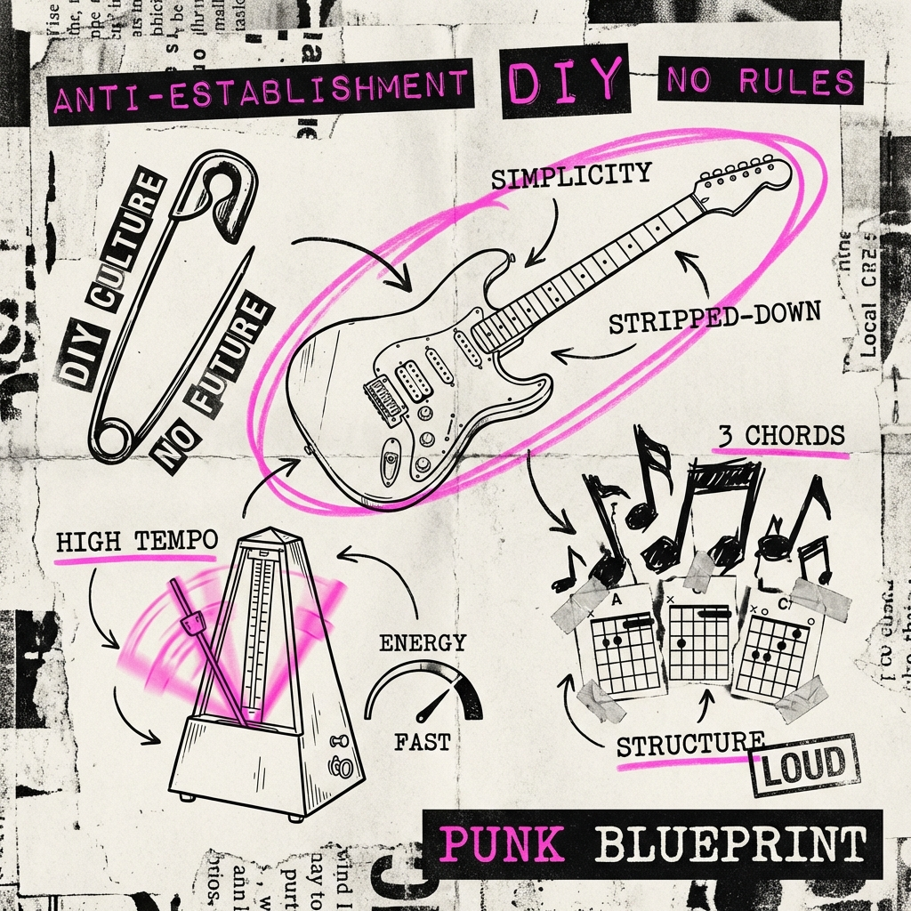

# 朋克 (Punk) - 愤怒的极简主义与文化爆破

> [!NOTE]
> **一句话简介**：朋克不只是一种音乐，它是文化界的“开源运动”——通过将表达门槛降至最低（三个和弦与一把旧吉他），让愤怒的年轻人夺回了被精英垄断的话语权。

## 1. 虚构与现实 (The Myth / The Construct)
*逻辑：从“直观理解”到“残酷真相”。*

*   **The Intuition (大众印象)**: 
    *   **视觉**：色彩鲜艳的莫西干头 (Mohawk)、满是别针的皮夹克、破烂的牛仔裤、无政府主义符号。
    *   **听觉**：喧闹的噪音、嘶吼的嗓音、毫无技巧的乐器演奏、混乱的现场。
    *   **关键词**：“反叛”、“破坏”、“无脑”、“下流”。

*   **The Reality (底层逻辑)**: 
    *   朋克本质上是一种**极端的极简主义 (Extreme Minimalism)** 和 **去中心化协议 (Decentralized Protocol)**。
    *   在它诞生之前，70年代的主流摇滚乐（如Pink Floyd, Led Zeppelin）已经演变成了一种**复杂的“皇家工程”**：需要昂贵的设备、高超的演奏技巧（长篇大论的吉他独奏）和宏大的叙事。这就像是当时的“闭源企业级软件”。
    *   朋克是一场**“降维打击”**：它宣称“你不需要十年的音乐学院训练，只要学会三个和弦，你现在就可以上台”。通过大幅降低**生产门槛**，它释放了被压抑的工人阶级表达欲。

## 2. 共识的演化 (Evolution of Consensus)
*逻辑：从无到有，从简单到复杂。*

*   **Origin (起源背景)**: 
    *   **时间**：1970年代中期。
    *   **土壤**：
        *   **美国 (NYC)**：在CBGB俱乐部，地下丝绒 (The Velvet Underground) 和 纽约娃娃 (New York Dolls) 开启了极简风潮，雷蒙斯 (Ramones) 确立了“快、狠、短”的标准范式。
        *   **英国 (London)**：经济大萧条，高失业率让年轻人绝望。性手枪 (Sex Pistols) 将这种音乐政治化，变成了愤怒的宣泄口。
    *   **痛点**：由于经济危机，年轻人买不起昂贵的乐器，也进不去高档的录音棚。他们需要一种**低成本、高能量**的娱乐方式。

*   **Evolution (演化路径)**: 
    *   **v1.0 原始朋克 (Proto-Punk)**: 充满实验性，不仅是快，更多是怪异（如 Iggy Pop）。
    *   **v2.0 朋克大爆炸 (Punk Explosion)**: 1977年，Sex Pistols 和 The Clash 将其推向主流，建立了“别针+皮衣”的视觉共识。
    *   **v3.0 分流 (The Fork)**: 
        *   **Hardcore**: 更快、更重、更政治化（如 Black Flag）。
        *   **Post-Punk/New Wave**: 继承了朋克的精神（打破规则），但引入了合成器和更复杂的艺术性（如 Joy Division, Talking Heads）。
        *   **Pop Punk**: 90年代 Green Day 将其商业化，保留了三和弦和速度，去掉了政治愤怒，变成了青春赞歌。

## 3. 解构“虚构” (Deconstructing the Fiction)
*逻辑：拆解它的内部支撑。*

*   **Pillars (核心支柱)**:
    1.  **DIY (Do It Yourself)**: 这是朋克的灵魂。没人给你出唱片？自己录。没人给你印杂志？自己做Fanzine（粉丝志）。衣服买不起？把旧衣服剪烂再用别针别起来。DIY精神实际上创造了现代的**独立创作者经济**雏形。
    2.  **3 Chords (三和弦通胀)**: 音乐结构被简化到极致。不需要复杂的变调，只用最有力度的强力和弦 (Power Chords)。
    3.  **Speed (速度)**: 歌曲通常只有2-3分钟。没有前戏，没有铺垫，上来就是高潮，结束就走人。这是对当时长达20分钟的前卫摇滚组曲的直接嘲讽。

*   **Rulebook (隐形规则)**:
    *   **真实 > 技巧**: 走音没关系，关键是你的情感是否真实。
    *   **破坏即创造**: 把旧的符号（女王头像、纳粹符号、十字架）剪切拼接，赋予新的讽刺含义（Situationalist International 情境主义国际的影响）。

## 4. 塑造现实 (Shaping Reality)
*逻辑：虚构如何反作用于物理世界。*

*   **Concrete Impact (现实影响)**:
    *   **设计美学**: 杰米·里 generic 德 (Jamie Reid) 为性手枪设计的“勒索信字体”（剪报拼贴风格），至今仍是平面设计的经典流派，影响了后来的自媒体排版和波普艺术。
    *   **独立音乐产业**: 朋克运动催生了无数独立厂牌 (Indie Labels)，打破了大型唱片公司的垄断，证明了“小众市场”也能存活。

*   **The Power (超能力)**: 
    *   它赋予了**普通人**自信。你不需要是天才，你只需要有话要说。这种精神后来延续到了互联网早期的博客文化和现在的短视频创作中——**人人皆可广播**。

## 5. 未来的变异 (Future Mutation)
*逻辑：它将去向何方？*

*   **Mutation (异变)**:
    *   **Cyberpunk (赛博朋克)**: 朋克精神与高科技结合。虽然音乐风格不同，但“High Tech, Low Life”和反抗巨型企业的内核是一致的。
    *   **Maker Movement (创客运动)**: DIY精神在硬件和代码领域的复兴。Arduino和3D打印机就是现代的“三和弦吉他”。
    *   **Crypto/Web3**: 在某种程度上，去中心化、反抗金融巨头、强调社区治理的加密朋克 (Cypherpunk)，是朋克精神在数字经济领域的直系后裔。
